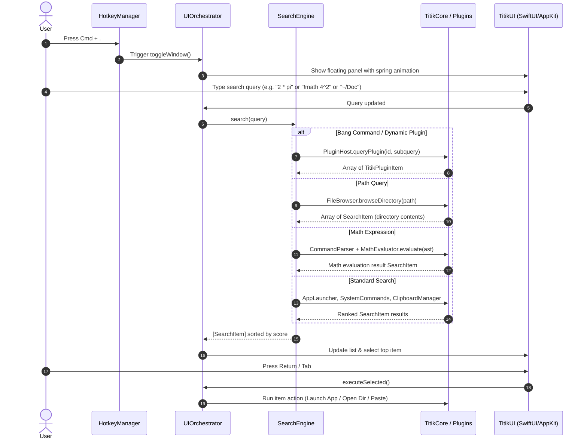

# Titik Architecture

This document provides a comprehensive technical overview of Titik's internal architecture, module separation, data flow, and runtime mechanics.

---

## 1. Modular Overview

Titik is built as a multi-target Swift package designed with clean boundaries, high concurrency safety (Swift 6 strict concurrency), and strict separation of concerns.

```text
┌────────────────────────────────────────────────────────┐
│                        Titik                           │
│                 (Executable Entry)                     │
└──────────────────────────┬─────────────────────────────┘
                           │
       ┌───────────────────┼───────────────────┐
       ▼                   ▼                   ▼
┌──────────────┐   ┌──────────────┐    ┌──────────────┐
│ TitikPlatform│   │   TitikUI    │    │ TitikSearch  │
└──────┬───────┘   └──────┬───────┘    └──────┬───────┘
       │                  │                   │
       ├──────────────────┴─────────┬─────────┤
       ▼                            ▼         ▼
┌──────────────┐             ┌──────────────┐ ┌──────────────┐
│ TitikKeymap  │             │ TitikPlugins │ │ TitikParser  │
└──────┬───────┘             └──────┬───────┘ └──────────────┘
       │                            │
       └──────────────┬─────────────┘
                      ▼
               ┌──────────────┐
               │  TitikCore   │
               └──────────────┘
```

### Module Responsibilities

1. **`TitikCore`**
   - **`ConfigManager`**: Thread-safe configuration loading, saving, environment expansion, and default value fallback.
   - **`PathResolver`**: Path expansion (`~`, `/`, relative paths), splitting, and parent traversal detection.
   - **`FuzzyMatcher`**: High-performance subsequence fuzzy matching algorithm with consecutive match and word-boundary scoring.
   - **`AppLauncher`**: High-speed indexing of `/Applications`, `/System/Applications`, and `~/Applications` with metadata extraction and caching.
   - **`ClipboardManager`**: Background polling of `NSPasteboard` change counts, history tracking, deduplication, and item classification.
   - **`SystemCommands`**: Native macOS management handlers (sleep, restart, shutdown, lock screen, mute, dark/light mode toggle).
   - **`Logger`**: Structured logging subsystem writing to `~/.local/state/titik/titik.log`.

2. **`TitikKeymap`**
   - **`HotkeyManager`**: Carbon Event HotKey API integration for system-wide global hotkey listening (`RegisterEventHotKey`).
   - **`Keycode` & `KeyModifier`**: Type-safe representations of macOS virtual keycodes and modifier masks.
   - **`KeymapRegistry`**: Thread-safe table of registered shortcut combinations and action callbacks.

3. **`TitikParser`**
   - **`CommandParser`**: Lexical analyzer and recursive descent parser.
   - **AST Types**: Distinguishes empty queries, math expressions (`BinaryOp`, `UnaryOp`, `FunctionCall`, `Constant`), bang commands, and raw text queries.

4. **`TitikPlugins`**
   - **`PluginHost`**: Dynamic bundle loader and registry discovering Apple `.bundle` and `.titikplugin` directories in `~/.config/titik/plugins/` and app bundle `PlugIns/`.
   - **`PluginManager`**: Manages plugin discovery, configuration state synchronization, enable/disable lifecycle, and hot-reload.
   - **Out-of-Process Worker (`titik-worker`)**: Dedicated sandboxed worker running dynamic plugins via Unix domain IPC pipes, memory isolation (2GB address space limits), and code signature verification.

5. **`TitikSearch`**
   - **`SearchEngine`**: Central dispatch provider querying applications, file hierarchies, math evaluation (`MathEvaluator`), clipboard history, and dynamic plugins.
   - **`MathEvaluator`**: Floating-point math evaluator supporting trigonometric operations, roots, logarithms, powers, bitwise operators, and constants.

6. **`TitikUI`**
   - **`Theme`**: Visual design tokens (glass background tints, border colors, selection fills, typography, animations).
   - **`SearchBarView`**: Custom search input field with live debounced updates and keyboard event delegates.
   - **`ResultsListView` & `ResultItemRow`**: Virtualized list rendering with match highlighting and category badges.
   - **`PreviewPaneView`**: Multi-format live preview pane for text, code syntax, images, audio, video, PDFs, and directory metadata.
   - **`ActionPaletteView`**: Secondary popover menu (`Cmd + K`) for context-specific actions (copy path, reveal in Finder, copy result).
   - **`ToastManager` & `ToastView`**: Non-intrusive floating feedback notifications.

7. **`TitikPlatform`**
   - **`WindowController`**: Borderless, floating `NSPanel` configuration with `.hudWindow` vibrancy and backdrop blur materials.
   - **`UIOrchestrator`**: Master coordinator connecting search engine events, key monitoring, active plugin states, and window lifecycle.
   - **`AutoPaster`**: Accessibility CGEvent synthesis engine to automatically paste selected clipboard items into active frontmost applications.

8. **`Titik` (Executable)**
   - Entry point configuring `NSApplication`, initializing configuration directories, registering global hotkeys, and running the Cocoa event loop.

---

## 2. Data Flow & Search Lifecycle



---

## 3. macOS Loadable Bundle Architecture

Titik enables dynamic extension without requiring recompilation of the host binary. Plugins are standard Apple loadable bundles (`.bundle` or `.titikplugin`) conforming to `TitikPluginKit` protocols (`TitikPlugin`, `TitikStreamingPlugin`).

### Bundle Structure

```text
MyPlugin.bundle/
└── Contents/
    ├── Info.plist              (CFBundleIdentifier, NSPrincipalClass)
    ├── MacOS/
    │   └── MyPlugin            (Mach-O loadable bundle/library binary)
    └── Resources/
        └── manifest.json       (Metadata, triggers, permissions, icon)
```

### Lifecycle & Loading Contract

```text
Host (Titik / titik-worker)                    Plugin Bundle (.bundle)
     │                                                   │
     │── Validate directory & manifest.json ────────────>│
     │── Verify code signature (SecStaticCode) ─────────>│
     │── Bundle(url: bundleURL).load() ──────────────────>│
     │── Resolve principal class (NSPrincipalClass) ─────>│
     │<── Returns conforming TitikPlugin.Type ───────────│
     │                                                   │
     │── pluginType.init(context: PluginContext) ───────>│
     │<── Plugin instance ready ─────────────────────────│
     │                                                   │
     │── plugin.onQuery(subquery) [async] ───────────────>│
     │<── Returns PluginCanvas (.list, .streaming) ──────│
     │                                                   │
     │── plugin.onShutdown() ────────────────────────────>│
```

Memory safety and crash resilience are guaranteed through out-of-process isolation: plugins execute in isolated `titik-worker` processes with address space limits (2GB RLIMIT_AS), memory sandboxing, and swift async cancellation.

---

## 4. UI Architecture & Native Materials

Titik uses standard Apple AppKit vibrancy layers combined with SwiftUI:

- **NSVisualEffectView**: Configured with `hudWindow` material and `behindWindow` blending mode to achieve the true macOS glass look.
- **Spring Physics**: All transitions, selections, and window toggles utilize customizable spring constants (`spring_stiffness`, `spring_damping`, `spring_mass`).
- **Low Latency**: Key monitoring uses `NSEvent.addLocalMonitorForEvents` directly on the main run loop to eliminate input lag.
